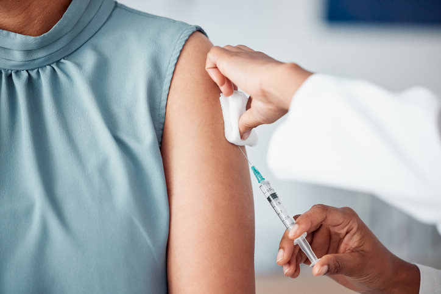
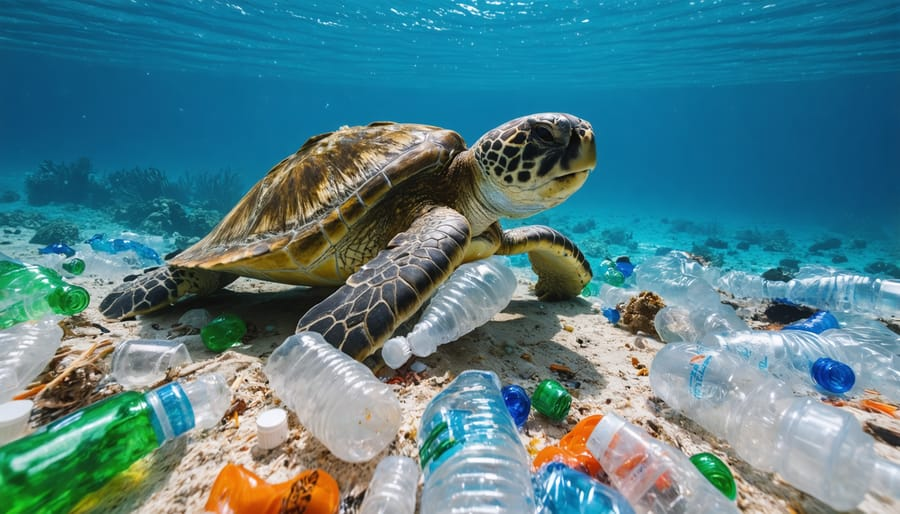

::: {.project-grid}

::: {.project-card}

<h3>Evaluating AI's Influence on Job Market Prospects in 2024</h3>

This study evaluates the growing integration of artificial intelligence in the workplace, examining how it is reshaping job structures, skill requirements, and employment dynamics, while analyzing early trends to inform strategies for adapting to an increasingly AI-driven workforce.

<a class="btn" href="pdfs/Evaluating%20Personal%20Job%20Market%20Prospects%20in%202024%20-%20Github.pdf" target="_blank">View Full Report (PDF)</a>

:::

::: {.project-card}

<h3>Transmission and Potential Outbreak of Model Disease X (Measles–Influenza Hybrid)</h3>

Advanced disease outbreak modeling using R, SPSS, and CDC data to implement deterministic and continuous-time models with the "deSolve" package; evaluated the impact of varying vaccination rates and calculated key metrics (V-critical of 96%) with Tableau.

<a class="btn" href="pdfs/The%20Transmission%20and%20Potential%20Outbreak%20of%20Model%20%20Disease%20X%20-%20Tracy%20Anyasi.pdf" target="_blank">View Full Report (PDF)</a>

:::

::: {.project-card}

<h3>The Impact of Human Waste Production (HWP) on Pollinator Biodiversity</h3>

Conducted extensive statistical analysis with Excel to explore the link between pollinator biodiversity and HWP—leveraging data from iNaturalist, UCLA Sustainability, Cal Fire, and the Los Angeles Almanac—and expanded scientific knowledge by 40%.

<a class="btn" href="pdfs/The%20Potential%20Correlation%20Between%20the%20Biodiversity%20of%20Pollinators%20and%20Waste%20Production%20of%20Humans%20in%20Tonnage%20on%20a%20Temporal%20scale%20at%20UCLA%20.pdf" target="_blank">View Full Report (PDF)</a>

:::

:::
